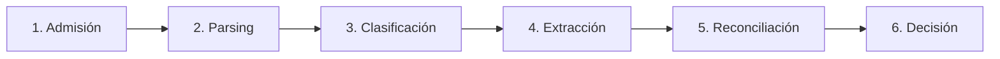
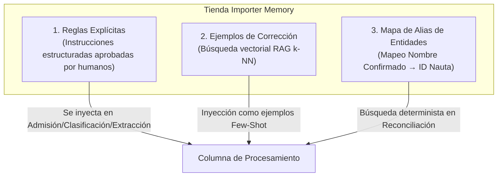
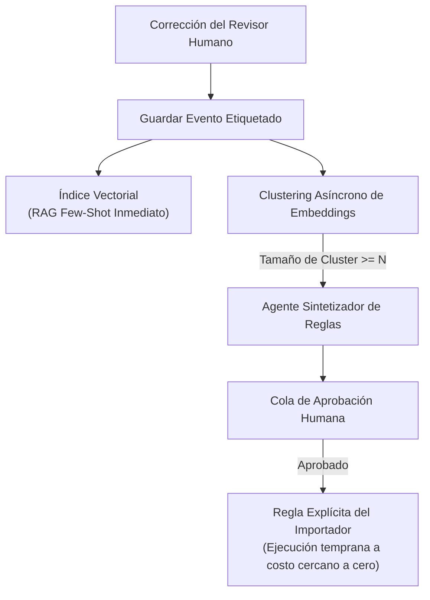

# Guía del Presentador: Diseño del Sistema Data-Entry Brain para Logística

Esta guía está diseñada para estudiar, presentar y defender la arquitectura del sistema detallada en [`SOLUTION.md`](file:///c:/Users/luisd/OneDrive/Documents/Nauta/SOLUTION.md). Utilízala para dominar los temas clave, estructurar la presentación, explicar las decisiones técnicas y responder con éxito en la sesión de preguntas y respuestas (Q&A).

---

## 1. Resumen Ejecutivo y Discurso Principal (Elevator Pitch)

### 💡 El Pitch de 30 Segundos
> *"Los enfoques tradicionales tratan la automatización del correo logístico como un simple problema de extracción de documentos (OCR). Pero extraer texto hoy es un commodity trivial. El verdadero desafío reside en la **interpretación** (las reglas arbitrarias de cada importador), la **identidad** (vincular nombres ambiguos con registros exactos de la base de datos sin corromper la información) y la **confianza** (saber cuándo actuar automáticamente y cuándo derivar a un humano). Nauta resuelve esto mediante una **Columna Vertebral de 6 Etapas** guiada por un **Cerebro** por importador que aprende continuamente de las correcciones humanas."*

### 🔑 Tabla de Conceptos Clave

| Concepto | El Mito / Error Común | La Realidad de la Arquitectura |
| :--- | :--- | :--- |
| **Dominio del Problema** | Extracción de datos y OCR | Interpretación, Identidad y Decisión basada en riesgo |
| **Lógica del Pipeline** | Agente LLM monolítico end-to-end | Pipeline híbrido de 6 etapas con Límite de Escritura libre de LLM |
| **Memoria del Sistema** | Ajuste fino (Fine-tuning) global de modelos | Tienda aislada RAG de 3 capas + Reglas Explícitas por importador |
| **Modelo de Confianza** | Promedio de puntuaciones de confianza | **Propagación del Eslabón Más Débil** + Umbrales por tipo de acción |
| **Aprendizaje** | Programación manual de reglas | **Bucle Doble** (Correcciones $\rightarrow$ RAG $\rightarrow$ Síntesis de reglas por clustering) |

---

## 2. Estructura Narrativa de la Presentación

Al presentar esta arquitectura, sigue este **marco narrativo de 4 partes**:

1. **El Reencuadre (Gancho):** Empieza derribando el mito de que el OCR con IA resuelve la logística. Enfatiza que cada importador tiene sus propias reglas implícitas y contradictorias.
2. **La Historia Ancla (Contexto):** Presenta el ejemplo práctico (*Acme Imports + correo de Pacific Logistics*). Utiliza este correo exacto como hilo conductor para explicar cada etapa del pipeline.
3. **La Columna y el Cerebro (Arquitectura):** Recorre las 6 etapas del pipeline de procesamiento y explica cómo *Importer Memory* inyecta contexto en cada paso.
4. **El Volante de Aprendizaje (Valor y Defensa):** Muestra cómo las correcciones de los revisores se sintetizan automáticamente en reglas explícitas con el tiempo, reduciendo costos y trabajo manual mientras se protege la integridad de los datos.

---

## 3. Análisis Profundo por Secciones y Guion del Presentador

---

### Sección 1: Reencuadre del Problema (Las 3 Capas)

#### 🎯 Objetivo de esta sección
Demostrar que la extracción representa solo ~15% de la dificultad real.

#### 🎙️ Guion / Puntos de Discurso
> *"Si le pasas un conocimiento de embarque (Bill of Lading) a un modelo como GPT-4, obtendrás un JSON limpio. Eso impresiona en una demo, pero en producción falla de inmediato debido a tres capas que rodean la extracción:*
>
> 1. **Capa de Interpretación:** Un documento titulado 'Purchase Order' puede ser en realidad una Factura Proforma para Acme Imports. La fecha de llegada (ETA) impresa en un conocimiento de embarque se ignora si el importador prefiere confiar en el cuerpo del correo. **Cada importador es su propio esquema.**
> 2. **Capa de Identidad:** Vincular 'Shenzhen Bright Co.' con el ID de proveedor #2847 en Nauta. Una coincidencia errónea corrompe silenciosamente todo el historial logístico.
> 3. **Capa de Confianza:** Nauta es el sistema de registro. Una escritura automatizada incorrecta genera estragos aguas abajo. El sistema debe conocer el límite de su propia certeza."*

---

### Secciones 2 y 3: La Columna Vertebral de Procesamiento (Las 6 Etapas)

Explica el pipeline paso a paso utilizando el ejemplo práctico.

#### Etapa 3.1: Admisión y Sandboxing (Intake & Sandboxing)
- **Mecanismo Clave:** Salida temprana para reglas de remitente (costo LLM de $0$) + **Separación estricta entre el Plano de Datos y el Plano de Control**.
- **Seguridad:** El contenido del correo se etiqueta en bloques `<CONTENT>` como datos externos no confiables para neutralizar ataques de Prompt Injection como *"ignora tus instrucciones anteriores"*.
- **Límite de Escritura:** Solo 4 acciones permitidas (`CREATE`, `UPDATE`, `IGNORE`, `ESCALATE`), validadas por un motor determinista libre de LLM.
- **Caso Práctico:** Correo de Pacific Logistics. No hay regla de ignorar. Nota de contexto adjunta: *"ETA en el cuerpo del correo sobreescribe la fecha del BoL."*

#### Etapa 3.2: Extracción e Interpretación de Formato (Parsing)
- **Mecanismo Clave:** Manejadores por tipo de archivo **100% deterministas (sin LLMs)** (PDF digital, OCR para escaneos, parser de Excel, descompresor ZIP).
- **Desafío Principal:** **Detección de límites de documentos (Document Boundary Detection)** — separar un único PDF de 5 páginas que contiene 3 documentos fusionados (Factura, Lista de Empaque, BoL) en fragmentos (chunks) lógicos.
- **Caso Práctico:** El PDF se divide en 4 chunks (chunk-0: cuerpo del correo, chunk-1: factura, chunk-2: packing list, chunk-3: BoL).

#### Etapa 3.3: Clasificación
- **Mecanismo Clave:** Subagente clasificador especializado con inyección de contexto de *Importer Memory*.
- **Auditabilidad:** Si una regla del importador sobreescribe la clasificación del documento, la salida incluye la etiqueta `importer_rule_applied: true`.
- **Caso Práctico:** Chunks clasificados como `INVOICE` (0.94), `PACKING_LIST` (0.91), `BILL_OF_LADING` (0.96), `EMAIL_BODY_WITH_ETA` (0.88).

#### Etapa 3.4: Extracción
- **Mecanismo Clave:** Subagentes especializados por tipo de documento (`InvoiceExtractor`, `BoLExtractor`).
- **Ejecución de Reglas:** Extraer datos fieles primero y luego aplicar una capa auditable de reglas de sustitución.
- **Caso Práctico:** `BoLExtractor` captura la fecha raw del documento (`2024-08-20`), pero aplica la regla del importador para sustituirla por la fecha del cuerpo del correo (`2024-08-14`). Ambas fechas se registran para auditoría.

#### Etapa 3.5: Reconciliación (Resolución de Identidad)
- **Mecanismo Clave:** Pipeline de resolución de entidades en 3 pasos:
  $$\text{Búsqueda en Mapa de Alias (Instantáneo)} \longrightarrow \text{Coincidencia Difusa (Fuzzy)} \longrightarrow \text{Desambiguación por Contexto}$$
- **Principio de Asimetría:** *No resolver = escalamiento humano. Resolver mal = corrupción catastrófica de datos.* En caso de duda, escalar.
- **Caso Práctico:** `"Shenzhen Bright Co."` no tiene alias inicial, coincide en fuzzy con `"Bright Electronics Shenzhen"` (score 0.81). El mapa de alias confirma la verificación humana previa de hace 6 semanas $\rightarrow$ Se resuelve al ID de Proveedor #2847 con confianza 0.96.

#### Etapa 3.6: Decisión y Enrutamiento
- **Mecanismo Clave:** **Propagación de confianza por el eslabón más débil:**
  $$C_{\text{final}} = \min(C_{\text{Parsing}}, C_{\text{Clasificación}}, C_{\text{Extracción}}, C_{\text{Reconciliación}})$$
- **Umbrales por Acción:** La confianza se evalúa por cada acción individual, no por correo. Actualizar un ETA (bajo riesgo) requiere 0.75; vincular una Factura a una Orden de Compra (alto riesgo) requiere 0.90.
- **Caso Práctico:** $C_{\text{final}} = 0.93$. Las 3 acciones requeridas superan sus umbrales $\rightarrow$ Escritura automatizada en Nauta DB con registro completo de procedencia.

---

### Sección 4: El Cerebro (Importer Memory)

#### 🎯 Objetivo de esta sección
Explicar cómo el sistema se adapta a cada cliente sin necesidad de reentrenar modelos globales.

#### 🧠 Arquitectura de 3 Capas

| Capa | Tipo | Velocidad de Actualización | Función Principal |
| :--- | :--- | :--- | :--- |
| **Mapa de Alias** | Clave-Valor Determinista | **Inmediata** | Evita coincidencias difusas repetidas en nombres conocidos |
| **Ejemplos de Corrección** | Índice Vectorial (RAG k-NN) | **Inmediata** | Aprendizaje pocas tomas (few-shot) para casos complejos |
| **Reglas Explícitas** | Restricciones Estructuradas | **Asíncrona (Horas/Días)** | Ejecución determinista de bajo/cero costo |

#### 🧊 Estrategia de Arranque en Frío (Cold Start)
1. **Bootstrapping Conservador:** Techo de confianza bajo inicialmente $\rightarrow$ alta tasa de escalamiento para recolectar correcciones humanas de alto valor.
2. **Reglas Semilla en Onboarding:** El importador configura alias conocidos y exclusiones el Día 1.
3. **Reglas Prestadas Provisionales:** Transferir patrones generales entre clientes, marcándolos como *provisionales* hasta su confirmación.

---

### Sección 5: El Bucle de Aprendizaje (Dual Learning Loop)

#### 🔄 Bucle A: Correcciones $\rightarrow$ RAG $\rightarrow$ Reglas Sintetizadas

#### 🎛️ Bucle B: Ajuste Automático de Umbrales
- Rastrea **Errores de Automatización** (umbral muy bajo $\rightarrow$ ajustar a más estricto) frente a **Escalamientos Innecesarios** (umbral muy alto $\rightarrow$ ajustar a más permisivo).
- La calibración ocurre de forma progresiva a lo largo de semanas de operación.

---

### Secciones 7 a 9: Seguridad, Escala, Limitaciones y Decisiones de Diseño

#### 🛡️ Matriz de Seguridad contra Prompt Injection
1. **Separación de Planos:** El contenido externo reside en bloques `<CONTENT>` dentro del prompt del sistema.
2. **Esquemas Estructurados:** Salida validada estrictamente por JSON Schema / Pydantic.
3. **Capa de Escritura Libre de LLM:** Motor determinista que solo ejecuta las 4 acciones permitidas.

#### ⚠️ Sección de Honestidad: Puntos Débiles de la Arquitectura
- **Fricción en Cold Start:** Alta carga manual inicial antes de acumular memoria.
- **Conflictos de Reglas:** Al crecer la memoria, reglas contradictorias pueden generar comportamientos ambiguos (requiere validadores de conflictos).
- **Cambios de Formato:** Cambios drásticos en plantillas de proveedores bajan la confianza y generan picos temporales de escalamiento.
- **Inconsistencia de Revisores:** Correcciones humanas contradictorias contaminan la memoria vectorial.

#### ⚖️ Defensa de Decisiones de Diseño

1. **RAG + Reglas Explícitas vs. Fine-tuning por Importador:**
   - *Por qué gana RAG:* Actualización inmediata (sin latencia de entrenamiento), 100% auditable y editable, sin olvido catastrófico.
2. **Pipeline Híbrido por Etapas vs. Agente End-to-End por Tipo de Documento:**
   - *Por qué gana el Pipeline Híbrido:* La clasificación debe ocurrir antes de elegir el agente especializado; los PDFs multidocumento comparten contexto; la reconciliación de entidades es independiente del tipo de documento.

---

## 4. Preparación para Preguntas y Respuestas (Q&A Cheat Sheet)

### Q1: "¿Por qué no hacer fine-tuning de un LLM para cada importador?"
**Respuesta:** El fine-tuning es una trampa en este dominio. Toma horas o días reentrenar, no ofrece visibilidad sobre *por qué* tomó una decisión y no se puede actualizar instantáneamente cuando un usuario crea una regla. RAG + Reglas Explícitas ofrece actualizaciones instantáneas, auditabilidad completa y seguridad determinista a un menor costo.

### Q2: "¿Qué pasa si un Prompt Injection dice 'Eliminar todos los embarques' en el cuerpo del correo?"
**Respuesta:** Falla en tres capas independientes:
1. El texto está aislado en un bloque `<CONTENT>` y enmarcado como datos no confiables.
2. El esquema del agente no posee ningún campo de comando `DELETE`.
3. La capa de ejecución al límite de escritura solo permite cuatro acciones: `CREATE`, `UPDATE`, `IGNORE`, `ESCALATE`.

### Q3: "¿Cómo manejan los errores de OCR en escaneos de mala calidad?"
**Respuesta:** Las puntuaciones de confianza del OCR acompañan a cada chunk. Un OCR deficiente reduce $C_{\text{Parsing}}$, lo que propaga una penalización de confianza según la regla del eslabón más débil. No rompe el pipeline; simplemente hace que la etapa de decisión derive el caso a un revisor humano con el texto OCR resaltado.

### Q4: "¿Cómo escala este sistema a miles de importadores?"
**Respuesta:** 
- La arquitectura utiliza nodos trabajadores sin estado (stateless) sobre colas por importador.
- El aislamiento entre clientes es puramente a nivel de datos (tablas e índices aislados en Importer Memory), no de infraestructura.
- La lógica de salida temprana (reglas de remitente en Etapa 1) permite que los correos rutinarios tengan un costo de $0$. El costo escala con la *complejidad*, no con el *volumen*.

---

## 5. Estructura Recomendada para una Presentación de 10 Diapositivas

1. **Portada:** Nauta Data-Entry Brain — Arquitectura y Diseño de Sistema
2. **El Problema:** Por qué la extracción es fácil, pero la entrada de datos en logística es difícil (Las 3 Capas)
3. **Ejemplo Ancla:** El desafío del correo multidocumento de Pacific Logistics
4. **Vista General:** La Columna Vertebral de 6 Etapas + El Cerebro del Importador
5. **Etapas 1–3:** Admisión, Parsing Determinista y Clasificación con Contexto
6. **Etapas 4–6:** Extracción, Reconciliación en 3 Pasos y Decisión por el Eslabón Más Débil
7. **Importer Memory:** Reglas Explícitas, Ejemplos RAG y Mapas de Alias
8. **El Volante (Flywheel):** Bucles Dobles de Aprendizaje (De Correcciones a Reglas y Calibración de Umbrales)
9. **Seguridad y Escala:** Sandboxing de Prompts y Aislamiento de Clientes
10. **Trade-offs y Casos Límite:** Por qué RAG supera a Fine-tuning y cómo gestionamos las fallas
